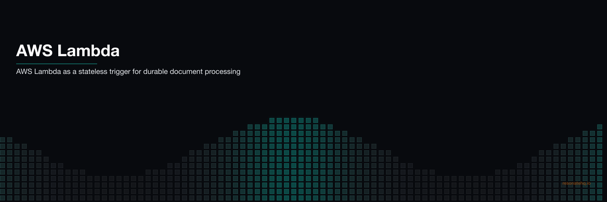

<p align="center">
  
</p>

# AWS Lambda + Resonate

Durable document processing beyond Lambda's 15-minute timeout — powered by Resonate.

A Lambda function receives a document processing request via API Gateway and returns 202 immediately. The actual processing — OCR extraction, LLM analysis, database storage, notifications — runs on a Resonate worker that can take hours without timing out.

```
API Gateway → POST /process-document → Lambda (returns 202 immediately)
                                              ↓
                                    resonate.run("doc/job_123", processDocument, job)
                                              ↓
                                    Resonate Server (durable state)
                                              ↓
                                    Resonate Worker (long-running Node.js)
                                    ├── downloadDocument  (checkpointed)
                                    ├── extractText       (checkpointed)
                                    ├── analyzeDocument   (checkpointed, LLM call)
                                    ├── storeResults      (checkpointed)
                                    └── notifyRequester   (checkpointed)

GET /status/:jobId → Lambda polls resonate.get("doc/job_123")
```

## Why Lambda alone isn't enough

| Constraint | Lambda | Lambda + Resonate |
|---|--------|-------------------|
| **Max execution** | 15 minutes | Unlimited |
| **Wait for human approval** | ❌ Not possible | ✅ `ctx.promise()` blocks indefinitely |
| **Retry failed steps** | Full function restart | Only the failed step retries |
| **State across invocations** | Lost on timeout | Persisted in Resonate Server |
| **Idempotency** | DIY | Built-in (promise ID) |

## The Lambda handler pattern

```typescript
// src/handler.ts
import { Resonate } from "@resonatehq/sdk";
import { processDocument } from "./workflow.js";

// Module-level: created once per Lambda container cold start
const resonate = new Resonate({ url: process.env.RESONATE_URL });
resonate.register("processDocument", processDocument);

export async function handler(event) {
  const job = JSON.parse(event.body);

  // Fire-and-forget — Lambda exits before workflow completes
  resonate.run(`doc/${job.jobId}`, processDocument, job).catch(console.error);

  return { statusCode: 202, body: JSON.stringify({ status: "accepted" }) };
}
```

**Compare to Restate on Lambda:** Restate makes Lambda the **executor** — your Lambda IS the step handler. Restate Cloud calls back into your Lambda functions to run each step. This requires a CDK stack, IAM roles, Restate Cloud environment, and the `@restatedev/restate-sdk/lambda` adapter.

**With Resonate:** Lambda is a stateless trigger. It calls `resonate.run()` — same as calling any async function. The Resonate worker handles execution. No CDK, no IAM roles, no service registration.

## Files

```
src/
  handler.ts    — Lambda handler (POST /process-document, GET /status/:jobId)
  workflow.ts   — 5-step document processing workflow (runs on Resonate worker)

local-demo/
  src/
    index.ts    — Express server simulating API Gateway + Lambda
    workflow.ts — Same workflow with crash simulation for demo
  package.json
```

## Prerequisites

### Local demo (no AWS account needed)

- Node.js 18+
- `cd local-demo && npm install`

### AWS deployment

- AWS account with Lambda + API Gateway access
- A running [Resonate Server](https://docs.resonatehq.io/server/install) (Resonate Cloud or self-hosted on ECS/EC2)
- A Resonate worker running the workflow code (separate Node.js process or ECS task)

## Run it locally

### Happy path

```bash
cd local-demo
npm start
```

**What you'll observe:**
- Lambda returns 202 before any workflow steps run
- Workflow runs in background: download → extract → analyze → store → notify
- `GET /status/:jobId` returns the completed result

### Crash / retry demo

```bash
cd local-demo
npm run start:crash
```

**What you'll observe:**
- LLM API times out on first attempt (rate limit error)
- `analyzeDocument` retried after 2 seconds
- `downloadDocument` and `extractText` do **not** re-run — checkpointed
- Document processed exactly once

## Deploy to AWS

### 1. Set up infrastructure

```bash
# Start the Resonate Server (e.g., on ECS or Resonate Cloud)
resonate serve

# Start a Resonate worker (long-running process that executes workflows)
# This is where your workflow code actually runs
RESONATE_URL=http://your-resonate-server:8001 tsx worker.ts
```

### 2. Build the Lambda bundle

```bash
npm install
npm run bundle  # outputs dist/handler.js
```

### 3. Deploy the Lambda function

```bash
# Create Lambda function
aws lambda create-function \
  --function-name document-processor \
  --runtime nodejs20.x \
  --handler handler.handler \
  --zip-file fileb://dist/handler.zip \
  --environment "Variables={RESONATE_URL=http://your-resonate-server:8001}"

# Add API Gateway trigger via AWS Console or SAM/CDK
```

### 4. Test

```bash
# Submit a document
curl -X POST https://your-api-gateway.amazonaws.com/prod/process-document \
  -H "Content-Type: application/json" \
  -d '{
    "jobId": "job-001",
    "documentUrl": "s3://my-bucket/contract.pdf",
    "requesterId": "user-alice",
    "type": "contract"
  }'
# → { "status": "accepted", "jobId": "job-001" }

# Poll for result
curl https://your-api-gateway.amazonaws.com/prod/status/job-001
# → { "status": "processing" }  (while running)
# → { "status": "done", "result": { ... } }  (when complete)
```

## Idempotency

The `jobId` is the Resonate promise ID. Submit the same `jobId` twice → same workflow execution, no duplicate processing. This is essential for Lambda because:
- API Gateway may retry on timeout
- Your client may retry on network failure
- Both are handled automatically — the document is processed exactly once.

[Try Resonate →](https://resonatehq.io) · [Resonate SDK →](https://github.com/resonatehq/resonate-sdk-ts)
